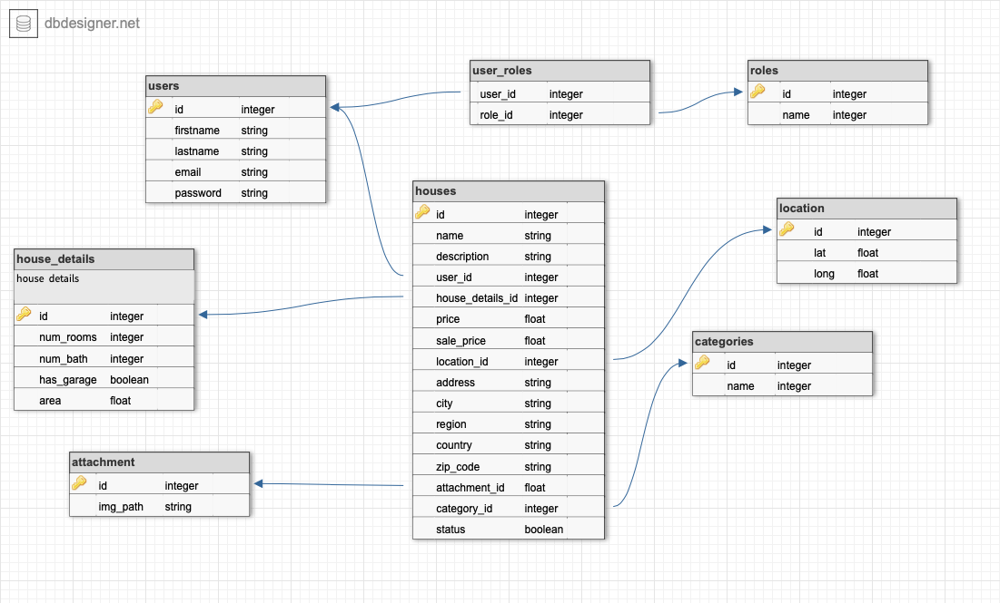

# Backend for Houzing Web App

### Project Description
This is a backend project for a real estate e-commerce website business. 

### Features
- User registration
- User verification by Email
- User login 
- JWT token based authorization
- CRUD operations for various tasks that have pagination features and filtration

### Requirements

### Technologies 
- Java 1.8 
- Spring Boot 2.5.2
  - Spring Web, Spring Data JPA, Hibernate, Spring Security, Spring Validation, Spring Mail
- JWT token based authorization
- PostgreSQL database (Heroku Postres)
- Lombok
- VCS (Git & GitHub) 
- CI/CD with GitHub and Heroku
- Swagger 2 for API documentation

### Deployment
- Backend API Endpoint documentation is live at this <a target="_blank" href="https://houzing.uzdevjs.online/swagger-ui.html">[website]</a>
- Frontend is TBD soon
